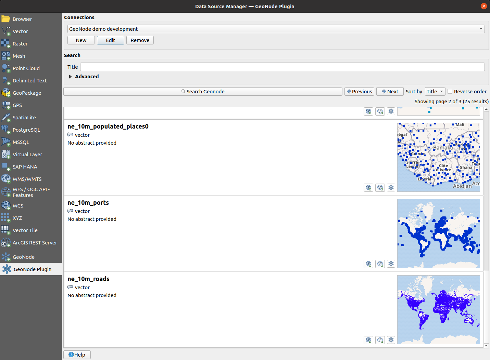

# QGIS GeoNode QGIS plugin

A [QGIS] plugin for working with [GeoNode] resources

[QGIS]: https://qgis.org
[GeoNode]: https://geonode.org

---

**Documentation:** <https://kartoza.github.io/qgis_geonode>

**Source code:** <https://github.com/kartoza/qgis_geonode>

---

This is a QGIS plugin to allow working with and managing GeoNode resources in QGIS.

## Installation

This plugin is available for installation via the main QGIS plugin repository. Inside QGIS, 
navigate to _Plugins -> Manage and Install Plugins..._, then search for `QGIS GeoNode` and install it

!!! Warning
    It may be necessary to **restart QGIS** after installing the plugin, since QGIS does not currently allow Python
    plugins to reload data providers dynamically

    Additionally, when activated, **this plugin replaces the core GeoNode provider** that comes preinstaled in QGIS.
    If you want to get the core provider back you will need to disable this plugin and restart QGIS.

!!! note
    Be sure to have the _Show also experimental plugins_ checkbox checked, the QGIS Plugin Manager _Settings_ section.

??? info "Extra - Installing from our custom plugin repo"
    In addition to installing from the official QGIS plugin repository.
    This plugin is also available for install from our own custom plugin repo. This may ocasionally have a newer version
    than the one present in the official QGIS repo (the reason being that the QGIS repo is manually curated and it 
    usually takes a while before a new version is approved by its maintainers)

    It is available at:
    
    <https://kartoza.github.io/qgis_geonode/repo/plugins.xml>
    
    1. Add this custom repository inside QGIS Plugin Manager
    1. Refresh the list of available plugins
    1. Search for a plugin named **QGIS GeoNode**
    1. Install it!

Check the [Development](development.md) section for a more developer oriented 
installation procedure 

## License

This plugin is distributed under the terms of the 
[GNU General Public License version 3](https://www.gnu.org/licenses/gpl-3.0.en.html)
