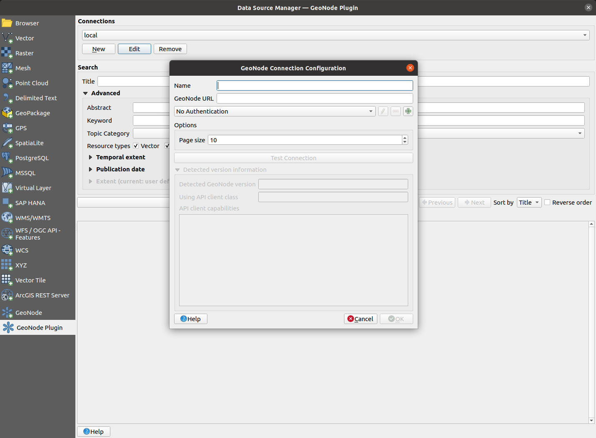
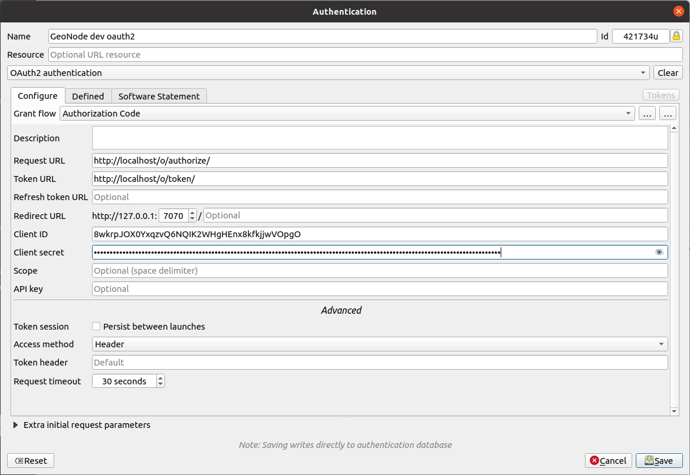

# User guide

The QGIS GeoNode plugin adds a new _Geonode Plugin_ section to the QGIS Data 
Source Manager dialogue. This section contains a familiar set of interface controls
that allow users to:

- [Manage GeoNode connections](#manage-geonode-connections)
- [Search for existing datasets]()
- [Load GeoNode datasets as QGIS layers]()

The plugin also adds a new _Geonode_ section to a QGIS layer's 
_Layer Properties_ dialogue. This section allows users to:

- [Upload QGIS layers to GeoNode]()
- [Reload/upload the style of a layer that came from GeoNode]()
- [Reload/upload some metadata attributes of a layer that came from GeoNode]()

## Manage GeoNode connections

### Add a new GeoNode connection

In order to add a new GeoNode connection:

1.  Open the QGIS _Data Source Manager (Ctrl+L)_ and go to the _GeoNode Plugin_ 
    section
  
2.  Add a new GeoNode instance connection, by clicking the _New_ button

3.  A new dialogue is shown. This dialogue requests the following details of 
    the GeoNode connection being created:

    1. _Name_ - The name used by QGIS to refer to this connection

    2. _GeoNode URL_ - The base URL of the GeoNode being connected to (_e.g._ 
       https://stable.demo.geonde.org)

    3. _Authentication_ - Whether to use authentication to connect to GeoNode 
       or not. See the [Configuring authentication](#configuring-authentication) 
       section below for more details on how to configure authenticated access
       to GeoNode

    4. _Page size_ - How many search results per page shall be shown by QGIS

4.  Optionally you may now click the _Test Connection_ button. QGIS will then
    try to connect to GeoNode in order to discover what version of GeoNode is
    being used by the remote server.

    Upon a successful connection, the detected GeoNode version will be shown
    below. Depending on the detected GeoNode version, the plugin may not be
    able to offer all of its functionalities. The supported capabilities are
    listed in the _API client capabilities_ section.

5.  Finally, accept the new connection dialogue by clicking the _Ok_ button. 
    Your new connection is now ready to be used.

### Edit an existing connection

In order to edit the details of an existing connection, just re-open the 
_QGIS Data Source Manager (Ctrl + l)_, go to the _GeoNode plugin_ section, 
select the relevant connection from the _Connections_ dropdown and click the
_Edit_ button. A dialogue similar to the one discussed above in the 
[Add a new GeoNode connection](#add-a-new-geonode-connection) section shall be
shown with the connection details ready for editing

### Removing a GeoNode connection

In order to remove an existing connection, re-open the
_QGIS Data Source Manager (Ctrl + l)_, go to the _GeoNode plugin_ section,
select the relevant connection from the _Connections_ combo box and click the
_Remove_ button. A confirmation dialogue will ask whether to really remove the
connection. Upon acceptance of this dialogue, the connection will be removed.

### Configuring authentication

!!! note
    In order to be able to gain authenticated access to a GeoNode connection 
    you will need to request that one of the GeoNode administrators create an 
    **OAuth2** application and provide you with the following relevant details:

    - _Client ID_
    - _Client Secret_

The plugin is able to authenticate to remote GeoNode instances by using
OAuth2 authentication. Most OAuth2 grant types implemented in QGIS are 
supported. We recommend using the _Authorization Code_ grant type. In order 
to configure such an authentication:

1. Open the main QGIS authentication settings dialogue by going to 
    _Settings -> Options..._ in the main QGIS menu bar and then access the 
    _Authentication_ section

2. Press the _Add new authentication configuration button_. A new dialogue is
    shown. In this dialogue, fill in the following details:

    1. _Name_ - The name used by QGIS to refer to the authentication 
       configuration
    
    2. _Authentication type_ - Select the `OAuth2 authentication` option from 
       the dropdown 
    
    3. _Request URL_ - This is derived from the GeoNode base URL and takes the 
       form `<geonode-base-url>/o/authorize/`, _e.g._ <https://stable.demo.geonode.org/o/authorize/>
    
    4. _Token URL_ - This is derived from the GeoNode base URL and takes the 
       form `<geonode-base-url>/o/token/`, _e.g._ <https://stable.demo.geonode.org/o/token/>
    
    5. _Client ID_ - The client ID you got from your GeoNode administrator
    
    6. _Client Secret_ - The client secret you got from your GeoNode administrator
    
    The remaining fields can be left at their default values

3. Now when 
   [configuring a new GeoNode connection](#add-a-new-geonode-connection), 
   select this newly created authentication configuration in order to have the
   GeoNode connection use it
   

## Search and load GeoNode datasets into QGIS

### Searching layers
Select the intended connection from the connections list, then click the "Search Geonode" button, 
after searching is complete a list of search results will be populated in a scroll area below the search buttons.

Buttons "Previous" and "Next" can be used to navigate search results when the results have been paginated.

Below image shows search results after search on the GeoNode demo server

  
### Using the search filters

The following search filters are supported

- `Title`
  
    The resource title is used to filter search results and returning records that contains the supplied title.

- `Abstract`
    
    Same as a title filter, records that contains the provided abstract value will be returned.

- `Keywords` 
    
    Search will filter all resources that have keywords that exactly matches the selected keyword. 

- `Topic Categories`
  
    Filters the resources that their categories exactly matches the selected category.

- `Resources types`
  
    Filters resources based on the selected resource types, the resource types selection is 
    mutually inclusive, if more than one type is selected, the search results will include all resources 
    that have been the selected.

- `Temporal extent` 
  
    This filter used to select resources based on the stored temporal extent. Two fields 
    `start` and `end` are used to represent the beginning and end of the extent respectively, during filtering
    both fields values are excluded.
    
    When both fields are supplied, resources containing temporal extent that is greater than `start` and less than `end` 
    will be returned. If only `start` is provided, resources with the temporal extent beginning that is greater than 
    `start` will be returned, if only `end` is provided resource with temporal extent end that is less than 
    `end` will be returned.
  

- `Publication date`
  
    This filter has similar conditions as the Temporal extent filter, the difference here is the filter is applied
    to the resource's publication date and not the resources temporal extent.
  

- `Spatial Extent`
  
    The spatial extent filter is used to filter resources based on their geospatial extent, the extent can be filled by
    using a QGIS layer extent, map canvas extent or values can be manually added.

Currently, each of the API version supports only certain filters, 
for API version 2 all search filters are supported except the `Spatial Extent` filter, while the CSW API supports only 
`Title` and `Abstract` filters.
 
### Ordering results

When searching for resources the results are ordered using their `name` by default, currently it is the only field
that is allowed for ordering results. The "Reverse order" checkbox which is beside "Sort by" combo box,
is used to change the order of the results, when unchecked the results return in ascending order and otherwise
when it is checked.

### Layer's page on the GeoNode instance
  
All search results item contain an "Open in Browser" button, which when clicked opens the layer GeoNode page
using the default browser.
  
### Loading a layer onto QGIS

After searching layers is complete, the search results items provide options for loading layers for the 
corresponding resources inside QGIS. 

Each search item has buttons that load layers via QGIS OGC providers e.g.  WMS for loading maps, WFS for loading 
vector layers and WCS for loading raster layers. Each of these buttons will have an icon that represents the respective
OGC service and a tooltip that explains about the button action.

The WFS button is used load the vector layers, WCS button for raster layers and WMS button is always
available for all resources that support it, if there is a problem with the resource URI the OGC buttons will not 
be available.

### Inspecting layer metadata
  
When loading the layer inside QGIS, the layer metadata from GeoNode are added into the loaded layer as
QGIS layer metadata.

To view the added metadata, right-click on the added layer and click _Properties..._  then from the 
Properties dialog select the _Metadata_ page.

Image showing metadata page that contains metadata for layer with title 'ARANDANO BRIGITTA 2030' 
from the GeoNode demo server

## Synchronize a loaded layer with GeoNode
Not implemented yet

### Modify layer data
Not implemented yet

### Modify layer symbology
Not implemented yet

### Modify layer metadata
Not implemented yet

## Modify layer access permissions
Not implemented yet

## Upload new layer to GeoNode
Not implemented yet

## Delete layer from GeoNode
Not implemented yet