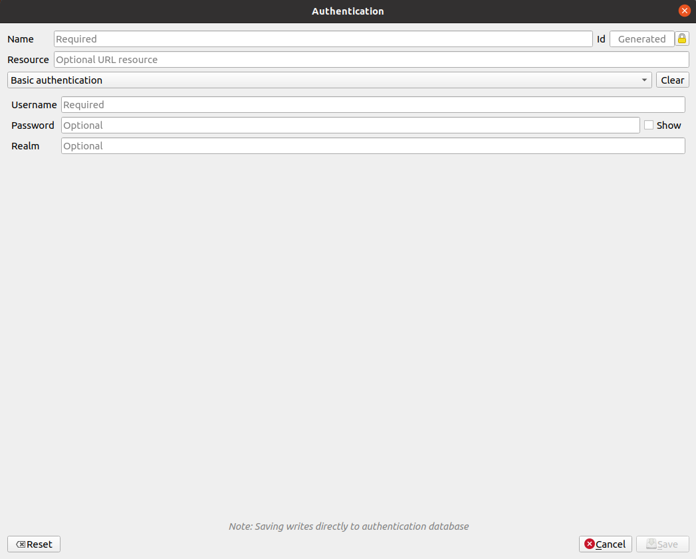
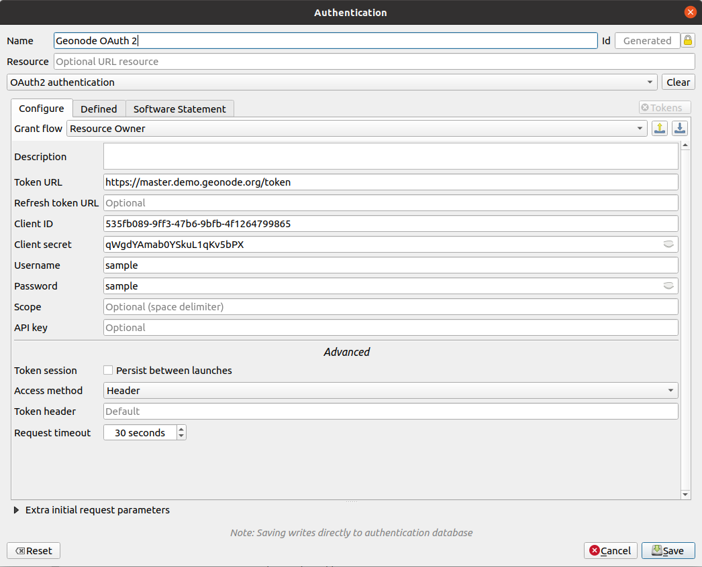
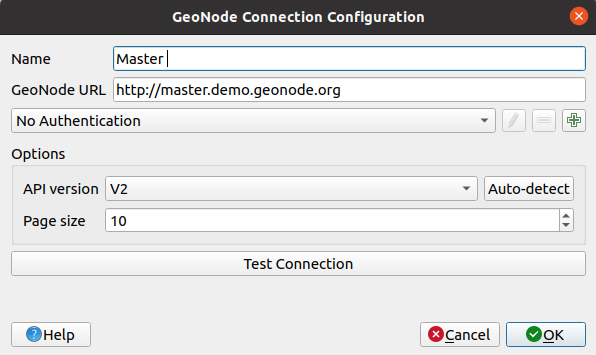
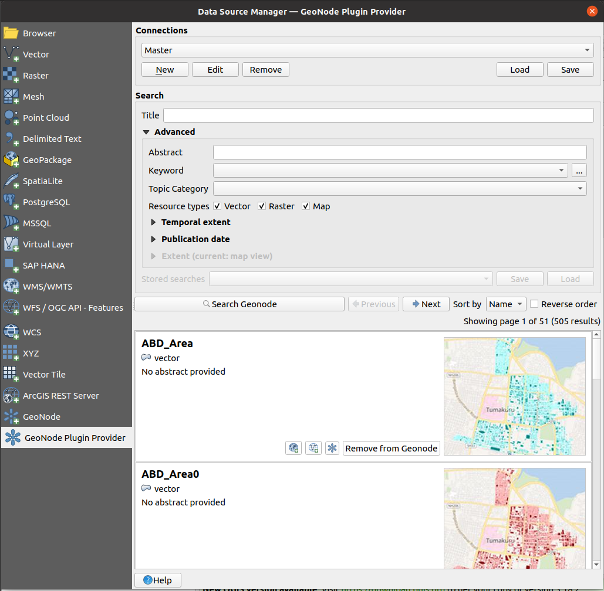

# User guide

This guide will take you through how to use the QGIS GeoNode plugin to access GeoNode instances resources inside QGIS.

## Add a GeoNode instance
To add a GeoNode instance follow the below steps.

1. Open the QGIS _Data Source Manager_ (Ctrl+L), go to _GeoNode Plugin Provider_ section
   
     
  
2. Inside "Connection" group box, click "New" button, a connection dialog will be shown.
3. Enter the GeoNode instance details "Name" and "URL", if the instance supports authentication, you can
  choose the authentication configurations for the instance using the QGIS authentication configuration selector widget 
     available on the connection dialog.
     
     To add new authentication configuration, click a button with  symbol
     which is beside the authentication configurations list combo box, the following dialog will be shown.
     
   `Basic Authentication` will be selected by default the first time the dialog is loaded, other authentication types are 
   available including OAuth2 authentication.
   
    Select the type that you want, and add all the required credentials then click save the 
   authentication configuration will be saved and selected to be used for the connection.
   
    Example OAuth2 authentication configuration
   
    The above image shows usage of a `Resource owned` OAuth2 configuration grant type and 
   contains sample credentials for `Token URL`, `Client ID`, `Client Secret`, `Username` and `Password`, all these details
   are supplied  by OAuth2 server credentials(for this case GeoNode). If you don't have the credentials, 
   contact the GeoNode instance admin to acquire them.
   
4. Through the "API version" list choose the API that the connection should be connected to with. They
are two options at the moment, CSW API and the API version 2 the latter is available from GeoNode instances that use the
   master version. Click the "auto detect" button, to automatically detect and select the API version for the GeoNode instance.
   
5. Set the search results page size inside the page size input. By default, the size is 10, 
   only integers greater than zero are allowed to be used.
   
6. Test the GeoNode instance connection by using a button with a label "Test Connection", click the button and if
connection is valid "Connection is valid" message will be displayed on the message bar otherwise a 
   "Connection is invalid" error message will be shown.
7. Click "Ok" button after finishing adding all the details, and the connection will be added. 
   Connection configurations using GeoNode demo instance
   
  

### GeoNode API V2
GeoNode API V2 is the latest API added in GeoNode, available from GeoNode version 3.2 and later versions, the API 
conforms to the [OpenAPI](https://swagger.io/specification/) specification which is a descriptive format for REST APIs.

When creating connections that are using this API, select V2 from the API version list. 
The API V2 support using OAuth2 usage, to add or use OAuth2 configurations, 
follow instructions described on step no 2 of the previous section.

### GeoNode API CSW
The CSW API exposes GeoNode resources via a CSW( Catalogue Service-Web) which is a web specification
for accessing geo-spatial data using [XML](https://en.wikipedia.org/wiki/XML). All GeoNode instances support this API.

This API doesn't support OAuth2 authentication instead it supports basic authentication,
when connecting to GeoNode instance that uses CSW API users will be required to supply username and password, 
in order to access private resources on the GeoNode instance.

## Search and load GeoNode layer into QGIS

- Searching layers
  
    Make sure the intended GeoNode instance connection is selected from the connections list inside the Connection 
    group box, then click the "Search Geonode" button, after searching is complete a list of search results will be 
    populated in a scroll area below the search buttons.
    
    Example search results
    
  
- Using the search filters
  
    Each of the API version has a set of supported filters, 
    for API version 2 available search filters are on 
  
    `title`, `abstract`, `keywords`, `categories`, `resources types`, 
    `temporal extent` and `publication date` properties.
  
    for CSW API available filters are only on `title` and `abstract`

    Filtering using `title`, `abstract` and `keywords` will search for resources that 
    contains the corresponding values. 
    
    Using the `category` or the `resource types` will return resources
    that have the exact match on the values.
    
    While filtering using the `temporal extent` and/or `publication date` will return resources that have greater 
    than the start datetime and less than the end datetime in either of the properties, the start and end datetime are exclusive.
    
    The support for `spatial extent` is not yet available.

- Ordering results

    When searching for resources the results are ordered using their `name` by default, currently it is the only field
    that is allowed for ordering results. The "Reverse order" checkbox which is beside "Sort by" combo box,
    is used to change the order of the results, when unchecked the results return in ascending order and otherwise
    when it is checked.
- Checking a layer's page on the GeoNode instance
  
    All search results item contain an "Open in Browser" button, which when clicked opens the layer GeoNode page
    using the default browser.
  
- Loading a layer onto QGIS

    In each of the search result items there are buttons to enable loading the result resource using the available 
    QGIS OGC providers (WMS for maps, WFS for vector and WCS for raster resources), in order to load the layer in QGIS
    click the available buttons for the respective providers.
    
    For the vector based resources WFS button be available, raster resources will contain the WCS button and WMS always be
    available for all resources that support it, if there is a problem with the resource URI the OGC buttons will not 
    be available as the resource will not be loadable.

- Inspecting layer metadata
  
    When loading the layer inside QGIS, the provider also load the available metadata from GeoNode into QGIS 
    layer metadata. To view the added metadata, right-click on the added layer and click _Properties..._  then from the 
    Properties dialog select the _Metadata_ page.

## Synchronize a loaded layer with GeoNode
Not implemented yet

### Modify layer data
Not implemented yet

### Modify layer symbology
Not implemented yet

### Modify layer metadata
Not implemented yet

## Modify layer access permissions
Not implemented yet

## Upload new layer to GeoNode
Not implemented yet

## Delete layer from GeoNode
Not implemented yet