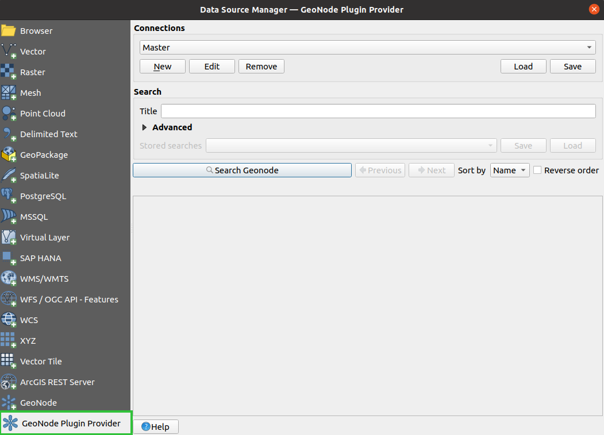
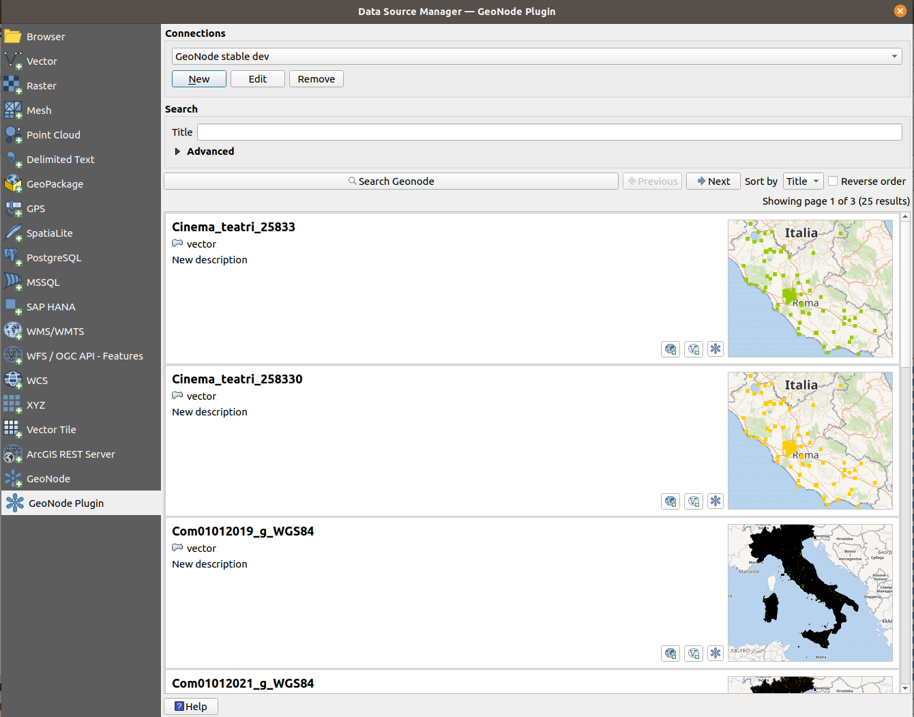

# User guide

This guide is going to show you how to use the QGIS GeoNode plugin to access GeoNode instances resources inside QGIS.

## Add a GeoNode instance
To add a GeoNode instance follow the below steps.

1. Open the QGIS _Data Source Manager_ (Ctrl+L), go to _GeoNode Plugin Provider_ section
   
     
  
2. Add a new GeoNode instance connection, click a button with a label "New" which is inside the "Connections" group box,
   then a dialog for filling in connection details will be shown.
3. Enter the GeoNode instance details "Name" and "URL", the "URL" is for the GeoNode URL, if the instance supports 
   authentication, you can choose the authentication configurations for the instance using the QGIS authentication 
   configuration selector widget available on the connection dialog.
     
     To add new authentication configuration, click a button with  symbol
     which is beside the authentication configurations list combo box, the following dialog will be shown.
     
   `Basic Authentication` will be selected by default the first time the dialog is loaded, other authentication types are 
   available including OAuth2 authentication.
   
    For API V2 we recommend to use OAuth2 with the Authorization code flow, for the legacy API use OAuth2 with 
   authorization code flow and also provide the username and password on the additional UI controls that are shown on 
   connection configuration dialog.
   
    The below image shows usage of a OAuth2 configuration with a `Authorization code` grant type and 
    sample `Token URL`, `Client ID`, `Client Secret`, all these details
     are supplied  by OAuth2 server credentials(for this case GeoNode).
    
   
    ### GeoNode API V2
    GeoNode API V2 is the latest API added in GeoNode, available from GeoNode version 3.2 and later versions, the API 
    conforms to the [OpenAPI](https://swagger.io/specification/) specification which is a descriptive format for REST APIs.
    
    When creating connections that are using this API, select V2 from the API version list. 
    The API V2 support using OAuth2 usage, to add or use OAuth2 configurations, 
    follow instructions described on step no 2 of the previous section.
    
    ### GeoNode API CSW
    The CSW API exposes GeoNode resources via a CSW( Catalogue Service-Web) which is a web specification
    for accessing geo-spatial data using [XML](https://en.wikipedia.org/wiki/XML). All GeoNode instances support this API.
    
    This API doesn't support OAuth2 authentication instead it supports basic authentication,
    when connecting to GeoNode instance that uses CSW API users will be required to supply username and password, 
    in order to access private resources on the GeoNode instance.

   
4. Through the "API version" list choose the API that the connection should be connected to with. They
are two options at the moment, CSW API and the API version 2 the latter is available from GeoNode instances that use the
   master version. Click the "auto detect" button, to automatically detect and select the API version for the GeoNode instance.
   
5. Search results page size can be set inside the page size input. By default, the size is 10.
   
6. Click the "Test Connection" button to verify if the connection works.
   
7. Click "Ok" button after finishing adding all the details, to add the connection.
   
   The picture below shows how you can configure anonymous access to the main GeoNode demo server
   
   
   

## Search and load GeoNode layer into QGIS

### Searching layers
Select the intended connection from the connections list, then click the "Search Geonode" button, 
after searching is complete a list of search results will be populated in a scroll area below the search buttons.

Buttons "Previous" and "Next" are used to navigate search results when the results have been paginated.

Below image shows search results after search on the GeoNode demo server

  
### Using the search filters

The following search filters are supported

- `Title`
  
    The resource title is used to filter search results and returning records that contains the supplied title.

- `Abstract`
    
    Same as a title filter, records that contains the provided abstract value will be returned.

- `Keywords` 
    
    Search will filter all resources that have keywords that exactly matches the selected keyword. 

- `Topic Categories`
  
    Filters the resources that their categories exactly matches the selected category.

- `Resources types`
  
    Resource type filter, selects resources based on the selected resource types, the resource type filtering is 
    mutually inclusive, if more than one type is selected, the search results will include all resources 
    that have been the selected.

- `Temporal extent` 
  
    Temporal extent filter is used to filter resources based on the stored temporal extent. Two fields 
    `start` and `end` are used to represent the beginning and end of the extent respectively, during filtering
    both fields values are excluded.
    
    When both fields are supplied, resources containing temporal extent that is greater than `start` and less than `end` 
    will be returned. If only `start` is provided, resources with the temporal extent beginning that is greater than 
    `start` will be returned, if only `end` is provided resource with temporal extent end that is less than 
    `end` will be returned.
  

- `Publication date`
  
    This filter has similar conditions as the Temporal extent filter, the difference here is the filter is applied
    to the resource's publication date and not the resources temporal extent.
  

- `Spatial Extent`
  
    The spatial extent filter is used to filter resources based on their geospatial extent, the extent can be filled by
    using a QGIS layer extent, map canvas extent or values can be manually added.

Currently, each of the API version supports only certain filters, 
for API version 2 all search filters are supported except the `Spatial Extent` filter, while the CSW API supports only 
`Title` and `Abstract` filters.
 
### Ordering results

When searching for resources the results are ordered using their `name` by default, currently it is the only field
that is allowed for ordering results. The "Reverse order" checkbox which is beside "Sort by" combo box,
is used to change the order of the results, when unchecked the results return in ascending order and otherwise
when it is checked.

### Layer's page on the GeoNode instance
  
All search results item contain an "Open in Browser" button, which when clicked opens the layer GeoNode page
using the default browser.
  
### Loading a layer onto QGIS

After searching layers is complete, the search results items provide options for loading layers for the 
corresponding resources inside QGIS. 

Each search item has buttons that load layers via QGIS OGC providers e.g.  WMS for loading maps, WFS for loading 
vector layers and WCS for loading raster layers.

The WFS button is used load the vector layers, WCS button for raster layers and WMS button is always
available for all resources that support it, if there is a problem with the resource URI the OGC buttons will not 
be available.

### Inspecting layer metadata
  
When loading the layer inside QGIS, the layer metadata from GeoNode are added into the loaded layer as
QGIS layer metadata.

To view the added metadata, right-click on the added layer and click _Properties..._  then from the 
Properties dialog select the _Metadata_ page.

Image showing metadata page that contains metadata for layer with title 'ARANDANO BRIGITTA 2030' 
from the GeoNode demo server

## Synchronize a loaded layer with GeoNode
Not implemented yet

### Modify layer data
Not implemented yet

### Modify layer symbology
Not implemented yet

### Modify layer metadata
Not implemented yet

## Modify layer access permissions
Not implemented yet

## Upload new layer to GeoNode
Not implemented yet

## Delete layer from GeoNode
Not implemented yet